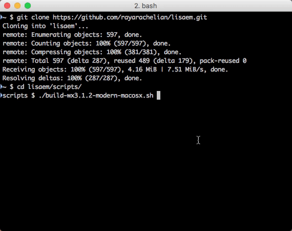
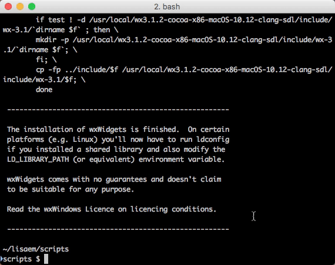
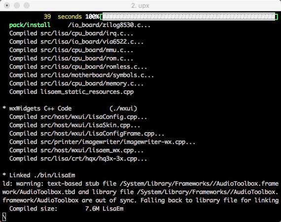

### Copyright © 2022 by Ray Arachelian, All Rights Reserved.
### Released under the terms of the GNU Public License v3.

------------------------------------------------------------------------------
# Lisa Emulator Source Build README
 
* [https://lisaem.sunder.net/]() 
* [https://lisafaq.sunder.net]() 
* [https://lisalist2.com]() 
* [https://github.com/rayarachelian/lisaem]()

------------------------------------------------------------------------------

## Note

Sadly, back in Feb 2022, I've been diagnosed with stage 4 cancer, my odds aren't great. I'll do what I can to finalize this release, but I may need help from the community to get help with maintaining LisaEm and future work. It's possible, though the odds are low, that I'll make it out ok. There's always hope, right?

## What is this thing?

You're looking at the repository for the source code for LisaEm 1.2.7 RC4 2022.04.01

LisaEm is a emulator that runs on a wide variety of modern and somewhat old systems by means of the wxWidgets framework, implementing an emulation of the (in)famous Apple Lisa Computer. The Apple Lisa computer is the predecessor of the Mac and the "inspiration" of many GUI environments from Windows 1.x to GEOS, GEM, VisiOn, etc. 

Many of the original ideas of the modern GUI, including copy and paste, were first envisioned in the Apple Lisa, so it's a historically very important machine. The seeds of these ideas were first found in the Xerox Alto, but the Lisa took them to their next logical step.

This document contains a few brief updates that are also found in the ChangeLog file, as well as some information on how to compile wxWidgets and LisaEm.

(The updates will go away once the bugs are removed as ChangeLog is better suited for them.)

## How do you pronounce LisaEm

The "Em" at the end of LisaEm is short for emulator, so therefore you say "Lisa" followed by the first syllable in Emulator, "Em", or if you're a native English speaker, sound out the letter M.
so: lee·suh·em,  \ ˈlē·sə·em \

Nomenclature wise, LisaEm is in line with the other Lisa related things such as Lisa Pascal Workshop, or Lisa Office System, or LisaWrite, or LisaList.

## Command Line Options

LisaEm accepts the following command line options which can be used to customize it in various situations such as running in a Kiosk mode on a Raspberry Pi inside a 3D printed Apple Lisa case, or for an automation pipeline:

```
Usage: lisaem [-h] [-p] [-q] [-f <str>] [-d] [-F[-]] [-z <double>] [-s[-]] [-c <str>] [-k] [-o[-]]
  -h, --help            show this help message
  -p, --power           power on as soon as LisaEm is launched
  -q, --quit            quit after Lisa shuts down
  -f, --floppy=<str>    boot from which floppy image ROMless only
  -d, --drive           boot from motherboard ProFile/Widget ROMless only
  -F, --fullscreen      fullscreen mode (-F- to turn off)
  -z, --zoom=<double>   set zoom level (0.50, 0.75, 1.0, 1.25,... 3.0)
  -s, --skin            turn on skin (-s- or --skin-- to turn off)
  -c, --config=<str>    Open which lisaem config file
  -k, --kiosk           kiosk mode (suitable for RPi Lisa case)
  -o, --originctr       skinless mode: center video(-o) vs topleft(-o-)
```
## 2022.04.01

Added TerminalWx console + preferences.

If you're using text based OS such as Monitor, LPW, UniPlus, (and eventually Xenix), if you enable the console TerminalWx window, you'll get a small terminal window that opens up along with the main window.
The purpose of this is to allow you to capture text output, or upload a text file, etc. rather than use the more limited graphical window.

UniPlus now works on LisaEm, however, you'll need to use a pre-install Widget/ProFile image that you'd download to a modern machine using BLU and then convert it using the blu-to-dc42 too.

Speaking of, many new tools have now been added and updated as well. They are:

```
blu-to-dc42                    - convert a BLU image to DC42 for use in LisaEm
dc42-add-tags                  - add tags to an image without them (does not fix missing tags)
dc42-copy-boot-loader          - copy the boot sector and loader from one image to another
dc42-copy-selected-sectors     - copy a list of sectors from one image to another
dc42-diff                      - diff two disk images
dc42-dumper                    - dump an image to text files
dc42-resize-to-400k            - resize a short DC42 to 400K
dc42-to-blu                    - convert a DC42 image to BLU so you can upload it back to a physical Lisa hard drive
dc42-to-raw                    - convert a DC42 image to RAW format
dc42-to-rraw                   - same but puts the tags at the ends of sectors rather than the start
dc42-to-split-raw              - convert a disk image to split
dc42-to-tar                    - untar a bunch of Xenix floppies to individual files
decode-vsrom                   - given a video state ROM dump, decode the serial number stored within
idefile-to-dc42                - convert an IDE:File image to Disk Copy format (written by Natalia Portillo)
lisadiskinfo                   - get info about a disk image
lisafsh-tool                   - Lisa File System shell tool - interactively work with a disk image (now with ReadLine support)
lisa-serial-info               - info about your Lisa's serial #
los-bozo-on                    - DRM Protect a Lisa Office System Tool
los-deserialize                - Deserialize and UnDRM a (un)branded Lisa Office System Tool
patchxenix                     - Patch Xenix for use with X/ProFile drives
raw-to-dc42                    - convert raw disk images to DC42 for use with LisaEm
rraw-to-dc42                   - convert reverse raw (tags at the end) disk images to DC42 for use with LisaEm
uniplus-bootloader-deserialize - deserialize the UniPlus loader off a ProFile/Widget hard drive
uniplus-set-profile-size       - don't use yet. This modifies the UniPlus kernel partition table sizes to use larger hard drives.
```

LisaFSH Tool now has readline support so tab expansion of commands and history are now available (for systems with GNU readline, history, ncurses)


## 2021.01.15

Added TerminalWx vt100 terminal widget, xmodem for interfacing with BLU
switched Preferences for serial port to pull down menu instead of radio button since there's too many endpoints now.
Disabled Serial port A as it causes crashing in Lisa Terminal

## 2020.08.21

Fixed "the bug" - Desktop menu, scrollbars, linker errors.
Rebuilt the display refresh system so that the refresh rate is relative to host timing, not guest CPU.
Added a checkbox to disable mouse scaling under the display menu (if the mouse is incorrect for your system, toggle this).

If you see weird behavior on startup, try deleting both the main preferences as well as the specific Lisa preferences.

------------------------------------------------------------------------------
## Special steps for Windows:

If you wish to build for Windows, Cygwin, along with regular gcc and mingw is required.

Please examine these two Cygwin installation batch files which will setup the appropriate packages.

* `cygwin-install64.bat` - for 64 bit systems (all modern ones today)
* `cygwin-install32.bat` - for older machines

They expect to live on the E:\ drive - this is because I use Virtualbox VMs for windows where the C:\ drive is for the OS, D:\ is the CDROM drive, and E:\ is the shared folder between my Linux machine and the VM.

You'll need to first download the Cygwin installers and name them as follows:

* `e:\setup-x86_64.exe` - for the 64 bit Cygwin installer
* `e:\setup-x86.exe` - for the 32 bit Cygwin install

As you'll need to right click on the appropriate one (32 bit vs 64 bit) and run as Administrator, it's highly recommended that you carefully examine what they do.

[The Cygwin installer requires that it be run as Administrator when scripted, otherwise it goes interactive and does not properly select the packages passed to it on the command line, this is a limitation of Cygwin, take it up with them by filing bug reports.]

These scripts expect to be run from the E:\ drive, and that you've downloaded the Setup.exe for Cygwin and have named it properly as the script expects. 

If your system doesn't or can't match this, please edit the install scripts as needed. 

This is recommended anyway, since you shouldn't trust anything that requires running as Administrator. Don't trust me because I'm trust worthy, trust me because you've personally verified that these scripts don't do anything malicious to your system. This should apply to anything you install on any machine. If you can't see the source code and verify for yourself that it does the right thing, you shouldn't be installing it.

Next, open the Cygwin terminal (MinTTY), use the scripts in the scripts directory that build wxWidgets, and then add the bin directory from the wxWidgets build to your PATH, and then build LisaEm - all these steps are done from the Cygwin terminal.

## Compiling wxWidgets for your system

The scripts directory contains several scripts that you could use to build wxWidgets for your system. We will generally link LisaEm statically, especially for macOS x and 

```
scripts/build-wx3.0.2-elder-macosx.sh
scripts/build-wx3.1.2-modern-macosx.sh
scripts/build-wx3.1.5-cygwin-windows.sh
scripts/build-wx3.1.5-gtk.sh
scripts/build-wx3.1.5-modern-macosx.sh
```
After wxWidgets is installed to `/usr/local/wxsomething`, add `/usr/local/wxsomething/bin` to your path before running the LisaEm build script.




## Compiling LisaEm (for all platforms):

You will need wxWidgets 3.0.4-3.1.5 installed. Do not use system provided wxWidgets, but rather build your own using the scripts in the scripts directory as mentioned above.

You will want to install/compile wxWidgets **without** the shared library option, except perhaps on GTK systems, but if you do this, it will not be portable except to systems of the same kind and version.

Unlike most apps that use autotools, or cmake, LisaEm uses the [bashbuild](https://github.com/rayarachelian/bashbuild) system which was created as a side effect of developing LisaEm. There's a fake `./configure` and `Makefile` that are just wrappers around `bashbuild`.

After installing/compiling wxWidgets, ensure that wx-config is in your path, cd to the LisaEm source code directly and run:

	./build.sh clean build
	sudo ./build.sh install 

(Don't use sudo on Cygwin, instead type in `./build.sh install` and you'll be prompted whether you wish to launch the command in an Administration MinTTY session, then the build will run from a second terminal window that runs within the Administrator context.)

This will install the lisaem and lisafsh-tool binaries to /usr/local/bin, and will install skins and sound files to /usr/local/share/LisaEm/; on Windows it will be installed to C:\Program Files\Sunder.Net\LisaEm and /Applications for macOS.




### Cross compiling

Cross compiling is possible by passing the -arch=xxx option to the top level build.sh script. This is how PPC binaries are built on an i386 10.5 VM.

(Sadly I could not get a wxWidgets 3.x compiled properly for macos x 10.4 - this would have been nice due to the ability of 10.4 to run classic macos 9 and earlier applications, which would have made a nice environment for running many classic apps, including Lisa Office Systems. If you find a way to get wxWidgets 3.0.2 or 3.0.4 on 10.4 please let me know.)

### Compressing binaries with UPX

If your system has the upx command available, it will also compress the resulting binary with upx in order to save space, it's a good idea to install this command. (The upx step is disabled for debug-enabled builds as it interferes with gdb, and on certain older versions of macOS X such as 10.8, 10.9 where it's broken and causes segfaults in the resulting binaries.)

### Statically linked wxWidgets

On Windows and macOS x we'll also want a static build so we don't have to ship a copy of wxWidgets along with the app. Of course building for your own system doesn't require that, however the included scripts are setup to produce static libraries, except for Linux/GTK.

If you don't plan on using wxWidgets for anything else on Windows or macOS x and have compiled static versions of wxWidgets and LisaEm, you may then discard the wxWidgets directory. You could also uninstall Cygwin. 

But you may find yourself needing to redo all this support infrastructure when a new version of LisaEm is released. Also, don't forget to clean up the resulting wxWidgets3.x.x directories under the script directory as they'll take up quite a lot of space.

Native OS provided copies of wxWidgets, such as those packaged with various Linux distributions are likely not going to work as well with LisaEm, so your mileage may vary. If you experience issues with those, please use the appropriate script in the scripts directory for your system to compile wxWidgets (although as I write this, the wxWidgets 3.0 for GTK provided with Ubuntu 18.04 seems to function correctly.)

### About macOS binary distributions

Binary distributions of LisaEm for macOS X provided on `dmg` images, will include multiple binaries for multiple CPU architectures such as PPC, PPC64, i386, and x86-64. While the macOS x `lipo` command can glue multiple architecture binaries together, it cannot let you package up multiple copies of a single architecture. To get around this, I've added an internal selector script `lisaem.sh` in the resources directory which is copied to `LisaEm.app/Contents/MacOS/lisaem.sh` - this scripts looks at your system and figures out what macOS version and CPU architecture you're running and then attempts to find the most likely binary suitable for your machine and runs that one.

Because some macOS/Xcode versions are only compatible with certain versions of wxWidgets, for example, Mac OS X 10.8 (Mountain Lion) will use a copy of LisaEm compiled against wxWidgets 3.0.4, while macOS 10.15 (Catalina) will run a copy of LisaEm compiled against wxWidgets 3.1.5. You can use the "About LisaEm" menu item under the credits to see the version.

Additionally a `--delete-other-binaries` option is provided in the script, so if you run `/Applications/LisaEm.app/Contents/MacOS/lisaem.sh --delete-other-binaries` from iTerm or Terminal, it will delete the shipped binaries that are not appropriate to your system, saving you a few MB.


